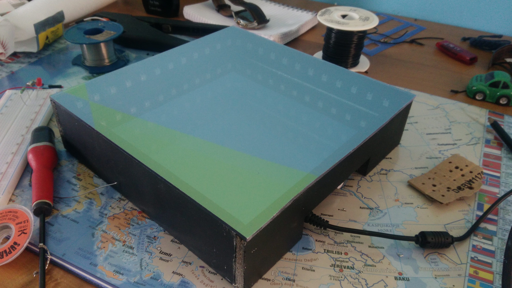

# Miroir-Infini

## Description :

Projet visant à la réalisation d'un objet de décoration. Utilisant la couleur des leds ainsi q'un miroir pour créer une illusion d'optique.

## Matériels utilisés :
- Ruban à led RGB 
- Carte arduino nano
- Miroir
- Plaque de PVC
-  Un film sans tain

## Principe :

Une moitié du reflet du ruban lumineux est emprisonnée entre les deux miroirs, alors que l’autre moitié passe à travers le miroir sans tain. On obtient donc visuellement un tunnel lumineux, qui semble bien plus profond que le dispositif lui-même. 
Le ruban à led met en valeur le tunnel formé. 

  

  

